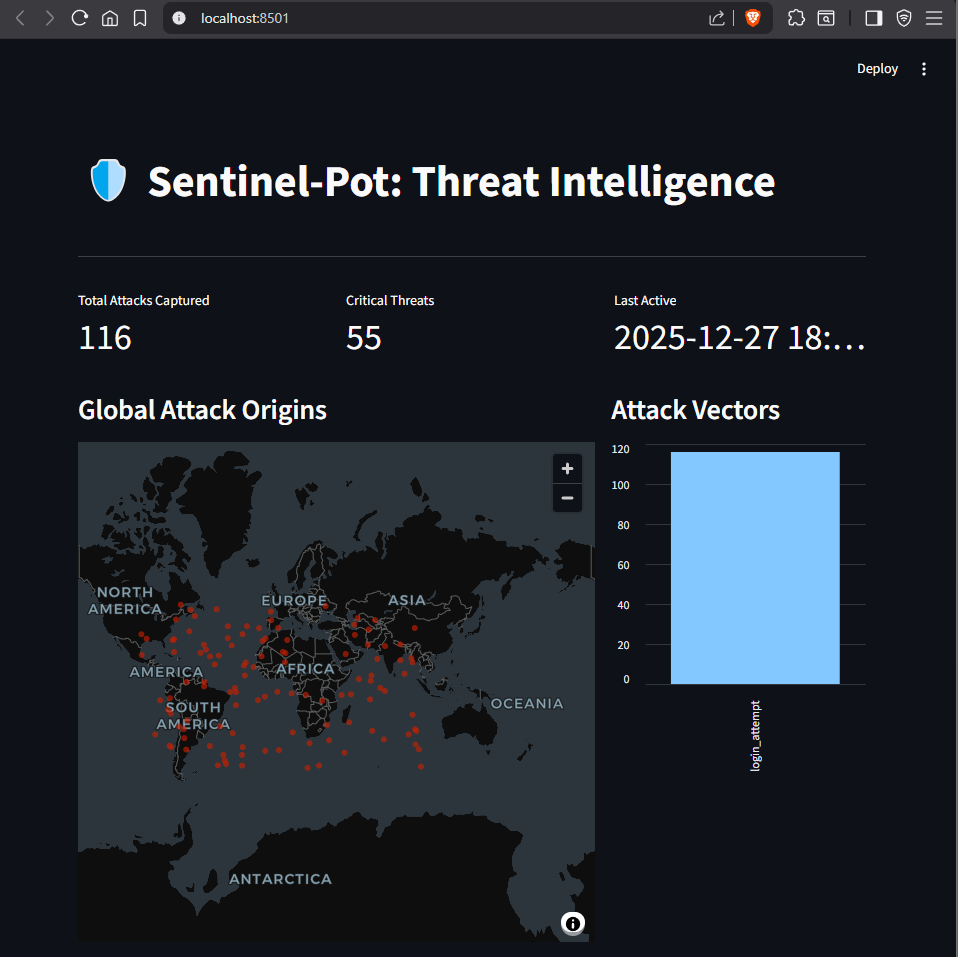
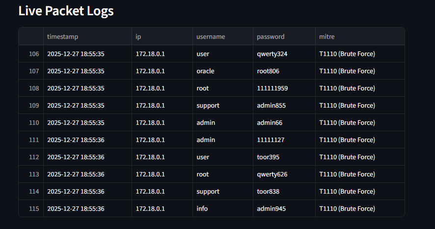
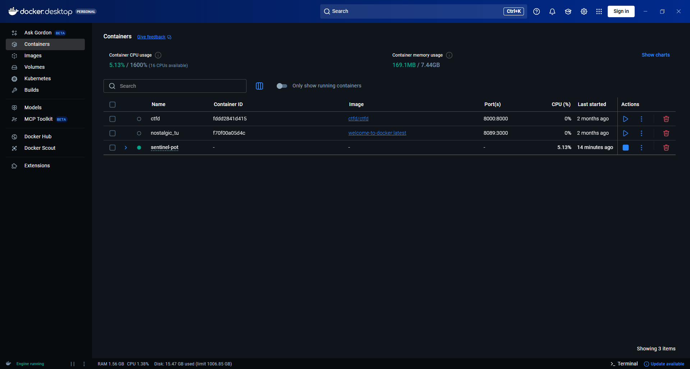

# 🛡️ Sentinel-Pot

<div align="center">

### Dockerized Threat Intelligence Honeypot


</div>

---

**Sentinel-Pot** is a deceptive threat intelligence system designed to capture, enrich, and visualize real-time cyber attacks. By simulating vulnerable SSH and Web services, it lures attackers, logs their activity, and maps their origins on a live interactive dashboard.

## 📸 Gallery

| **Live Dashboard** | **Packet Logs** | **Infrastructure** |
|:---:|:---:|:---:|
|  |  |  |
| *Real-time visualization of attack vectors* | *Detailed credential & MITRE tagging* | *Isolated Docker environment* |

---

## ⚠️ Disclaimer

> [!WARNING]
> **Educational Use Only:** This project is for research purposes.
> * Do not run this on critical production networks.
> * This tool intentionally exposes vulnerable services to the internet.
> * The author is not responsible for any damage caused by misuse.

---

## 🚀 Features

* **🕵️ SSH Deception:** Custom Paramiko-based SSH server that captures brute-force credentials.
* **🌐 Web Trap:** Fake "Corporate Login" portal (Flask) to capture web-based credential stuffing.
* **🧠 Automated Enrichment:** Maps IP addresses to physical locations and assigns MITRE ATT&CK tags.
* **📊 Live Visualization:** Streamlit dashboard with real-time world maps and attack statistics.
* **📦 PCAP Forensics:** Automatically captures full packet traffic (`.pcap`) for Wireshark analysis.
* **⚔️ Attack Simulator:** Built-in module to test your defenses safely from localhost.

---

## 🛠️ Tech Stack

| Component | Technology | Description |
| :--- | :--- | :--- |
| **Core Logic** | Python 3.11 | Backend orchestration and logic |
| **Containerization** | Docker | Isolation and ease of deployment |
| **Frontend** | Streamlit | Real-time interactive UI |
| **Sensors** | Paramiko & Flask | SSH and HTTP listeners |
| **Networking** | Tcpdump & Ngrok | Packet capture and global tunneling |

---

## 🔧 Installation

### Prerequisites
* [Docker Desktop](https://www.docker.com/products/docker-desktop/) (Installed and running)
* [Ngrok](https://ngrok.com/) (Free account required)

### Quick Start

1.  **Clone the Repository**
    ```bash
    git clone [https://github.com/yourusername/Sentinel-Pot.git](https://github.com/yourusername/Sentinel-Pot.git)
    cd Sentinel-Pot
    ```

2.  **Configure Ngrok**
    * Download `ngrok.exe` and place it in the project root.
    * Update `ngrok.yml` with your authtoken and tunnel configuration.

3.  **Launch System**
    * Run the automated launcher script:
    * **Windows:** Double-click `launch_sentinel.bat`
    * *(This script handles port cleaning, docker builds, and tunnel initialization)*

4.  **Access Dashboard**
    * Open your browser to: `http://localhost:8501`

---

## ⚔️ Simulation Mode

Want to see the dashboard light up without waiting for real hackers? Run the built-in attack simulator in a new terminal:

```bash
python attack_simulator.py